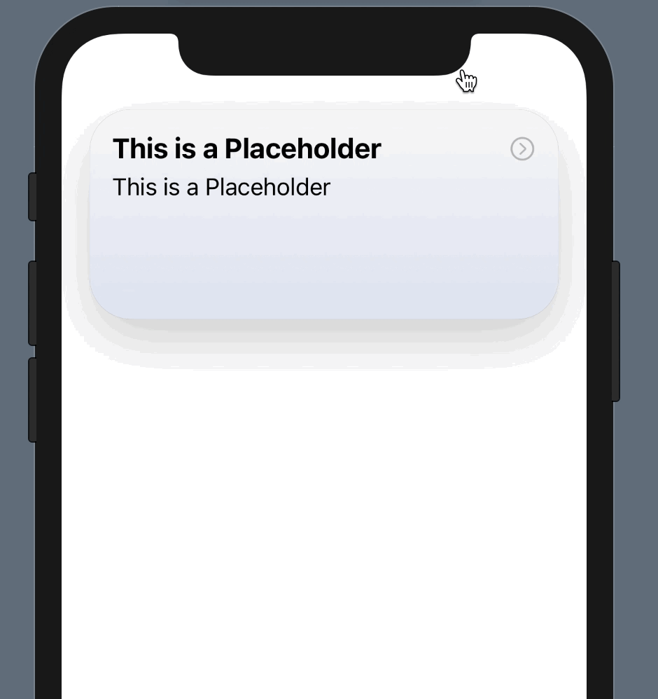

# ExpandableWindow-SwiftUI
Small view that you can use to add a small window that can be expanded with a press on the arrow button

# Installation
To add this to your app, just copy the ExpandableWindowView.swift to your project folder and call it with ExpandableWindowView(titleText: "Your Title Text", subtitleText: "Your Subtitle Text").

